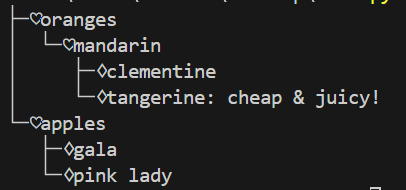

# 软件工程Funny-Json-Explorer(FJE)实现
本项目主要使用工厂方法、抽象工厂、建造者模式、组合模式完成了实验要求  
运行方式是在命令行执行如下命令：
```
python main.py -f <json file> -s <tree/rectangle> -i <none/poker/music>
```
例如执行如下命令:
```
python main.py -f test.json -s tree -i poker
```
得到下图结果  

